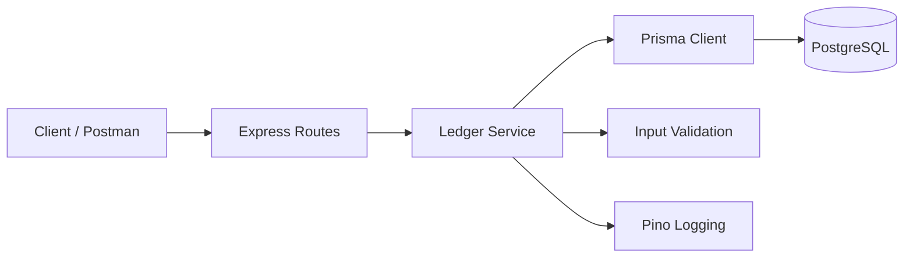
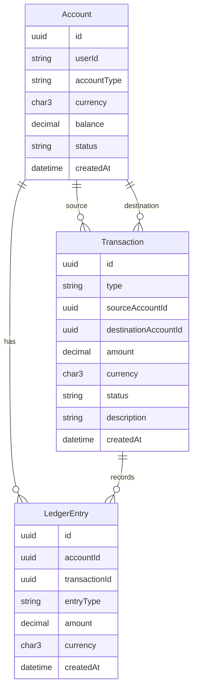

docker exec -it financial-ledger npm run prisma:migrate
docker-compose restart db app
# Financial Ledger REST API

Production-ready REST API for double-entry bookkeeping, safe fund transfers, and complete ledger auditability.

## Overview

- Account creation/retrieval with running balances
- Atomic transfers with double-entry ledger rows (debit/credit)
- Serializable isolation with deterministic row locks to keep concurrency safe
- Docker-first setup; Prisma ORM over PostgreSQL; Jest/Supertest coverage

## Setup & Run (Docker recommended)

### 1) Configure environment
Create `.env` (dev) and `.env.test` (tests):
```env
DATABASE_URL=postgresql://postgres:password@db:5432/ledger
NODE_ENV=development
PORT=3000
```

### 2) Docker
```bash
docker-compose up -d
docker exec -it financial-ledger npm run prisma:migrate
docker exec -it financial-ledger npm run dev
# API: http://localhost:3000
```

### 3) Local (without Docker)
```bash
npm install
npm run prisma:generate
npm run prisma:migrate
npm run dev
```

## API
- See [README_API.md](README_API.md) for full reference.
- Postman collection: [postman-collection.json](postman-collection.json) (import and set `baseUrl`, default `http://localhost:3000`).

### Common endpoints
- POST `/accounts` — create account
- GET `/accounts/:id` — account details and balance
- GET `/accounts/:id/ledger` — ledger entries
- POST `/transfers` — atomic transfer

## Design Decisions

- **Double-entry bookkeeping**: Every transfer writes two ledger rows in `LedgerEntry` (debit on source, credit on destination) plus a `Transaction` envelope. Balances are derived from ledger aggregation and mirrored into `Account.balance` for fast reads.
- **ACID strategy**: Transfers run inside a single Prisma `$transaction` wrapping all reads/writes. If any step fails (lock, validation, ledger write), the whole unit rolls back.
- **Isolation level**: `Serializable` (see [src/services/ledgerService.js](src/services/ledgerService.js#L18-L88)) to eliminate write skew and phantom issues for concurrent transfers.
- **Concurrency & locking**: Rows are locked in deterministic order using `FOR UPDATE` on account IDs to avoid deadlocks while preventing double-spend.
- **Balance calculation & overdraft prevention**: Source balance is recomputed from ledger rows before posting a transfer; if the `Decimal` amount exceeds balance, the transfer is rejected. After writing ledger rows, balances are recalculated to keep `Account.balance` in sync, preventing negative balances.

## Architecture Diagram



## Database Schema (ERD)



## Testing
```bash
npm test                      # all tests
npm test -- src/_tests_/ledger.test.js
bash api-test.sh              # manual smoke (Docker)
```

## Project Structure
```
src/
├─ app.js            # Express app wiring
├─ server.js         # HTTP bootstrap
├─ index.js          # Entry point
├─ prismaClient.js   # Prisma client
├─ errors.js         # Error classes
├─ routes/
│  ├─ accounts.js
│  └─ flows.js
├─ services/
│  └─ ledgerService.js
└─ _tests_/ledger.test.js

prisma/
├─ schema.prisma
└─ migrations/

tests/example.test.js
docker-compose.yml, Dockerfile
postman-collection.json
```

## Health & Troubleshooting
```bash
curl http://localhost:3000/accounts        # health
docker-compose logs -f app                 # docker logs
psql $DATABASE_URL -c "SELECT 1"           # db connectivity
npx prisma migrate status                  # migration state
npx prisma migrate reset                   # reset (destructive)
```

## License

